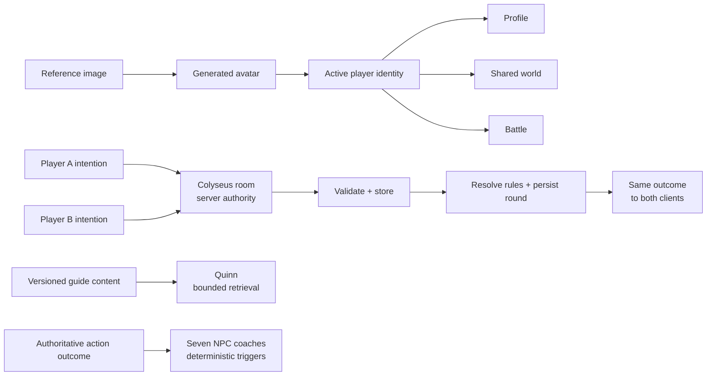

# FightGame — private presentation one-page draft

Status: public-evidence draft; `PENDING` John wording approval

Intended use: 2 minute 30 second guided section plus optional evidence follow-up

Language: English-first draft; bilingual presentation treatment remains
`[JOHN TO APPROVE]`

## Evidence sources and claim boundary

- Public portfolio case: [`../../fightgame.html`](../../fightgame.html)
- Approved sanitized evidence pack:
  [`../../portfolio-rag/project-sources/FIGHTGAME_PUBLIC_EVIDENCE.md`](../../portfolio-rag/project-sources/FIGHTGAME_PUBLIC_EVIDENCE.md)

The source repository remains private and was not inspected for this draft.
This document does not infer a private root cause, client identity, public
launch, production status or business result.

## Proposed headline

> A personalized-avatar multiplayer RPG where identity stays coherent and the
> server—not either player—owns the authoritative battle result.

`[JOHN TO APPROVE]`

## Simplified architecture draft

The final visual must preserve three distinct mechanisms: avatar generation,
Quinn's bounded retrieval and deterministic battle coaching. They must not be
presented as one generic AI layer. Final inclusion: `[JOHN TO APPROVE]`.

## Guided speaking draft

FightGame is a client-delivered personalized-avatar multiplayer pixel RPG. The
hard problem was not another game screen. One player identity had to stay
coherent across profile, shared-world, remote-player and battle contexts, while
two players could submit different actions and still receive one authoritative
turn result.

I translated the broad direction into staged systems and acceptance criteria.
The client treats an action as an intention. The server waits for the required
inputs, validates and stores them, resolves the rules, persists the round and
sends the same result to both clients. This prevents either browser from
becoming the authority.

The AI-related parts are deliberately separated. A reference-image flow
connects generated avatars to the active player identity. Quinn, the
non-combat Game Guide, retrieves only from versioned guide content and can
explain the player's selected cards. Seven battle coaches do not use RAG; they
respond through deterministic triggers, priorities and cooldowns tied to the
authoritative action outcome. The card system has a code-verified 79-card
catalogue with deck limits, elements, counters, statuses and combo structure.

My role was product direction and acceptance. I set priorities and module
boundaries, organised persistent Agent ownership, reviewed the integrated
multiplayer, battle, identity, map and interface flows, and decided what was
actually ready. Agents accelerated substantial client, server and tooling
implementation, tests, contract checks and bounded corrections.

The strongest correction example came from cross-device UAT. Two devices
showed inconsistent multiplayer results. I captured the expected and actual
behavior, made the failure reproducible, routed it to the responsible Agent and
repeated the complete cross-device regression after correction. The public
evidence does not disclose the private technical root cause, so this
presentation should not invent one.

The commissioned core-playability milestone was completed and accepted.
Tournament, streaming and operations work was not commissioned or remained
planned or partially scaffolded. This is not a claim of public launch,
production readiness, users, revenue or verified business impact.

Exact delivery wording and emphasis: `[JOHN TO APPROVE]`.

## Defect and correction card draft

| Stage | Public-safe statement |
| --- | --- |
| Symptom | Multiplayer results differed across devices during complete-flow UAT. |
| Reproduction | John tested browser, phone and another computer, recording expected versus actual behavior and screenshots. |
| Routing | The repeatable defect was assigned to the responsible development Agent. |
| Correction | The bounded implementation was corrected; the private technical root cause is not disclosed in public evidence. |
| Regression | John repeated the cross-device flow and checked both players received the authoritative result. |
| Acceptance | Acceptance applied to the complete playable flow, not an isolated screen or Agent completion message. |

Card wording: `[JOHN TO APPROVE]`. Any supporting non-public capture:
`[JOHN TO SUPPLY]` `[JOHN TO REDACT]`.

## Optional evidence drawer

- Client: Phaser; multiplayer rooms: Colyseus; APIs: Express.
- Code-verified catalogue: 79 cards.
- UAT surfaces: browser, phone and another computer.
- Accepted scope: commissioned core-playability milestone.
- Public evidence excludes private source, client identity, raw logs,
  credentials and infrastructure details.

Evidence selection and whether the 79-card fact appears in the spoken route:
`[JOHN TO APPROVE]`.

## Do not claim

- a public launch or production-ready operating service;
- user, revenue, adoption, reliability or verified business-impact metrics;
- that Quinn is a vector database or mature permission-aware enterprise RAG;
- that deterministic battle coaches use RAG;
- a private technical root cause that is absent from the approved evidence;
- that tournaments, streaming or operations were delivered as commissioned
  scope.

