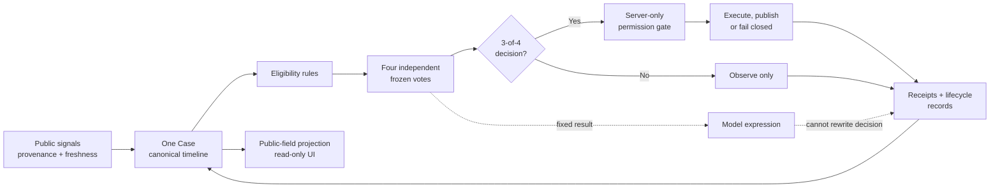

# Niulai Squad — private presentation one-page draft

Status: public-evidence draft; `PENDING` John wording approval

Intended use: 2 minute 30 second guided section plus optional evidence follow-up

Language: English-first draft; bilingual presentation treatment remains
`[JOHN TO APPROVE]`

## Evidence sources and claim boundary

- Public portfolio case: [`../../niulai.html`](../../niulai.html)
- Approved public-source snapshot: commit
  `9489e1ff4710351ce5eba11f33790e4241b293ff`, selected in
  [`../../portfolio-rag/project-sources/NIULAI_PUBLIC_REPOSITORY.generated.md`](../../portfolio-rag/project-sources/NIULAI_PUBLIC_REPOSITORY.generated.md)
- Public-feedback decision record:
  [`../NIULAI_PUBLIC_FEEDBACK_EVIDENCE.md`](../NIULAI_PUBLIC_FEEDBACK_EVIDENCE.md)

The clean-room public repository proves only its deterministic offline
reference, fixtures, fake-transport safety lab and public release. It does not
prove the separate runtime system. Runtime and operating statements below come
only from the already published portfolio case and remain bounded by that
case's disclosure language.

## Proposed headline

> Four Agents, one canonical timeline, and separate control planes for
> evidence, decisions, model expression and external action.

`[JOHN TO APPROVE]`

## Simplified architecture draft

Visual wording and final inclusion: `[JOHN TO APPROVE]`.

## Guided speaking draft

Niulai Squad starts from a product problem: market monitoring can surface
signals, but it does not naturally create a traceable, replayable story. Adding
models creates another risk—facts, opinions, decisions and permissions can
become blurred.

I designed the system around one Case and one canonical timeline. Lark gathers
public candidates with provenance and freshness. Four roles then make
independent random votes, and those votes are frozen before any model dialogue.
A three-of-four or four-of-four outcome becomes the fixed business decision.
The models can express that outcome in character, but they cannot rewrite the
evidence, the vote or the decision.

External authority is separated again. A server-side permission gate decides
whether an eligible result may proceed to a controlled action or publishing
worker. Pending or ambiguous state stops safely instead of being guessed or
blindly retried. Receipts, lifecycle events and correction evidence return to
the same timeline, while the public website receives only a read-only
projection.

My role was product and architecture ownership: defining the four-role model,
the single-timeline structure, voting and permission boundaries, strategy
revisions, failure review and final go/no-go decisions. Development Agents
accelerated implementation, tests, adapters, isolated workers, incident
diagnosis and bounded operating tasks.

The most useful failure example was an unexpected asset-unit projection. I did
not patch the displayed result. I traced the gap to receipt interpretation,
tightened the evidence rule, added regression protection, reran the controlled
lifecycle and made a scoped re-acceptance decision.

The published case records a frozen technical baseline, controlled real
lifecycle validation and a responsive read-only deployment. It does not claim
long-term unattended reliability, a formal SLA, verified user adoption,
revenue or business impact.

Exact delivery wording and emphasis: `[JOHN TO APPROVE]`.

## Failure and recovery card draft

| Stage | Public-safe statement |
| --- | --- |
| Symptom | An unexpected asset-unit projection exposed a gap between a receipt and its interpretation. |
| Response | Stop treating the displayed projection as accepted evidence. |
| Diagnosis | Trace the discrepancy to receipt interpretation without rewriting the historical result. |
| Correction | Tighten the evidence rule and protect it with regression coverage. |
| Re-validation | Rerun the controlled lifecycle and confirm the affected scope. |
| Acceptance | John makes a scoped re-acceptance decision; it does not imply acceptance of unrelated operating or business claims. |

Card wording: `[JOHN TO APPROVE]`. Any supporting non-public capture:
`[JOHN TO SUPPLY]` `[JOHN TO REDACT]`.

## Optional evidence drawer

- Frozen baseline recorded on the public case: 779/779 automated tests plus
  full validation and responsive read-only deployment.
- Controlled lifecycle evidence described publicly: funded route UATs, TP, SL,
  time-exit outcomes, confirmed-revert recovery and zero-exposure closure.
- Selected public reactions: three separate public observers noticed the
  interface or parts of the control model. These are external observations,
  not testimonials, adoption evidence or an audit.
- Public reference: deterministic, offline and independently reproducible at
  its pinned commit; it must remain labelled separately from runtime evidence.

Evidence selection and whether the numeric baseline appears in the spoken
route: `[JOHN TO APPROVE]`.

## Do not claim

- that the clean-room public repository is the production runtime;
- unrestricted autonomous execution or publishing;
- long-term reliability, SLA, adoption, retention, revenue or business impact;
- that social comments are customer testimonials or an independent audit;
- an official relationship, sponsorship or endorsement for the fan-parody
  project.

